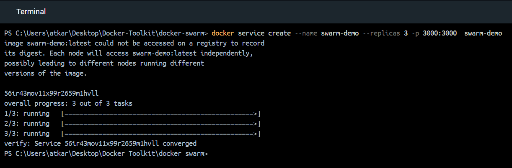
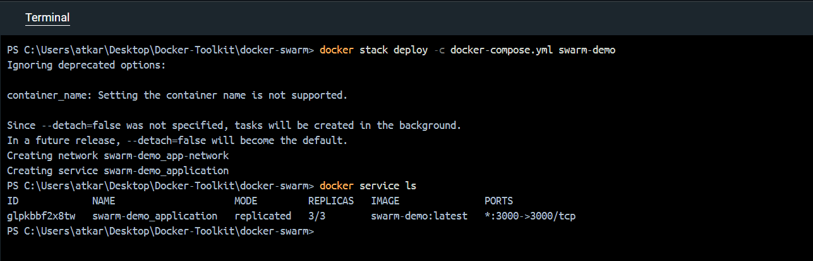
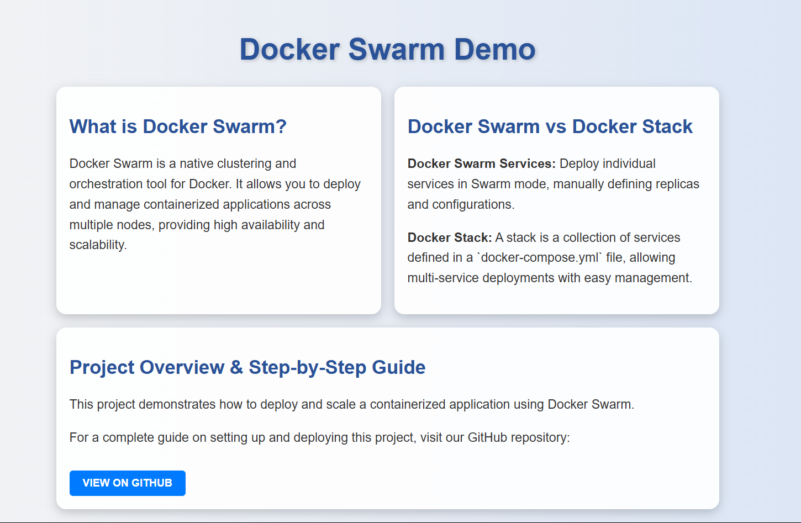

# Docker Swarm Demo

## Overview
This project demonstrates demo application orchestration in Docker Swarm using a simple **frontend and backend** application. The backend is a Node.js server that serves a static HTML file. Docker Swarm is used to deploy and manage the application with multiple replicas.

## Project Structure
```
├── backend/
│   ├── server.js  # Node.js Express server
│   ├── Dockerfile # Dockerfile for backend
│   ├── public/
│   │   ├── index.html  # Simple frontend
└── docker-compose.yml  # Docker Swarm configuration (for stack deployment)
```

## Setup & Deployment

### **Option 1: Using Docker Swarm Service Deployment**
If you want to deploy the application as an individual service, use:

#### 1️⃣ Build the Docker Image
```sh
docker build -t swarm-demo ./src
```

#### 2️⃣ Deploy the Service
```sh
docker service create --name swarm-demo --replicas 3 -p 3000:3000 swarm-demo
```



#### 3️⃣ Verify the Deployment
```sh
docker service ls   # List running services
docker service ps swarm-demo   # Check running containers
```

#### 4️⃣ Access the Application
```sh
curl http://localhost:3000   # For backend
```
Or open **http://localhost:3000** in a web browser.

### **Option 2: Using Docker Swarm Stack Deployment**
If you want to deploy using a **stack (multi-container application)**, use:

#### 1️⃣ Deploy the Stack
```sh
docker stack deploy -c docker-compose.yml swarm-demo
```



#### 2️⃣ Verify the Deployment
```sh
docker service ls   # List running services
docker service ps swarm-demo   # Check running containers
```

**In Docker Desktop**


#### 3️⃣ Access the Application
```sh
curl http://localhost:3000   # For backend
```
Or open **http://localhost:3000** in a web browser.



## Scaling in Docker Swarm
To **manually scale** the service, run:
```sh
docker service scale swarm-demo=5
```
To **simulate traffic load**, use:
```sh
while true; do curl -s http://localhost:3000 > /dev/null; sleep 0.5; done  # Linux

while ($true) { Invoke-WebRequest -Uri http://localhost:3000 -UseBasicParsing | Out-Null; Start-Sleep -Milliseconds 500 }   # Windows PowerShell
```

Check the CPU usage of the containers.

## Cleanup
To remove the deployment:
```sh
docker service rm swarm-demo   # For service deployment
```
```sh
docker stack rm swarm-demo   # For stack deployment
```

---