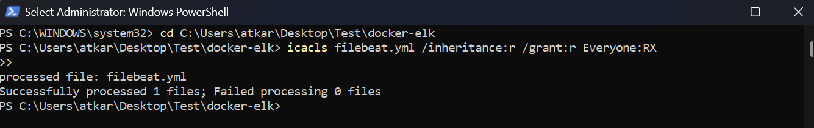

# **Logging with ELK Stack**  

This document details the setup and implementation of **Docker daemon logging** with the **ELK stack (Elasticsearch, Logstash, and Kibana)** using **Filebeat**. The logs are collected from the **Docker daemon**, processed via **Logstash**, stored in **Elasticsearch**, and visualized in **Kibana**.

---

## **📌 Architecture Overview**  

The pipeline consists of the following components:

### **1️⃣ Filebeat**  
- Filebeat acts as the **log shipper**.
- It collects **Docker daemon logs** and forwards them to **Logstash**.
  
### **2️⃣ Logstash**  
- Logstash receives logs from Filebeat, **processes them**, and sends them to **Elasticsearch**.
- It helps in **log filtering, transformation, and structuring**.

### **3️⃣ Elasticsearch**  
- The main **data store** where logs are indexed and stored.
- Allows efficient **search and retrieval** of logs.

### **4️⃣ Kibana**  
- A UI tool used to **visualize and analyze logs** stored in Elasticsearch.
- Allows creation of **dashboards, alerts, and queries**.


---

## **📦 Installation & Running the Stack**  

### **Run Docker Compose**
```sh
docker-compose up -d
```

- This will start **Elasticsearch, Logstash, Kibana, and Filebeat**.  
- Filebeat will **automatically start collecting logs** and forwarding them to Logstash.  

---

## **🔍 Verification Commands**  

### **Check Running Containers**
```sh
docker ps
```

### **Verify Elasticsearch is Running**
```sh
curl -u kibana_system:password http://localhost:9200/_cat/indices?v
```

  

### **Check Kibana Status**
```sh
docker logs -f kibana
```

### **Check Logstash Logs**
```sh
docker logs -f logstash
```

### **Verify Filebeat is Sending Logs**
```sh
docker logs -f filebeat
```

---

## **📊 Accessing Kibana**  

- Open **Kibana** in your browser:  
  ```
  http://localhost:5601
  ```
- Go to **Stack Management → Index Patterns**.  
- Create a new **index pattern** for `Logstash-*`.  
- Save the pattern and navigate to **Discover** to monitor logs.

---

## **🔑 Important Notes & Configuration**  

### **1️⃣ Set Proper Permissions for `filebeat.yml`**  
Filebeat requires correct permissions for `filebeat.yml` to work correctly.  

#### **Linux**
```sh
chmod 600 filebeat.yml
```

#### **Windows (Run in PowerShell as Administrator)**
```powershell
icacls ./conf/filebeat.yml /inheritance:r /grant:r Everyone:RX
```



---

### **2️⃣ Disable Security for HTTP Access**  
By default, **Elasticsearch** expects HTTPS. Since we're using **HTTP**, disable security in `elasticsearch.yml`:

```yaml
xpack.security.enabled: false
```

---

### **3️⃣ Ensure Correct Elasticsearch Credentials**
- **Username:** `kibana_system`
- **Why?** Kibana needs this account to interact with **Elasticsearch**.

Ensure the following environment variables are set in **docker-compose.yml**:

```yaml
environment:
  - ELASTICSEARCH_USERNAME=kibana_system
  - ELASTICSEARCH_PASSWORD=password
```

---

## **🛠 Changing Elasticsearch Password (If needed)** 

To change the password for `kibana_system` user:

```sh
docker exec -it elasticsearch bin/elasticsearch-reset-password -u elastic
```

For other users:

```sh
docker exec -it elasticsearch bin/elasticsearch-reset-password -u kibana_system
```

---

## **🔄 Restarting & Stopping the Stack**  

### **Restart Containers**
```sh
docker-compose restart
```

### **Stop the Stack**
```sh
docker-compose down
```

---