# Monitoring with Prometheus & Grafana using Docker

## Overview
This project demonstrates how to set up **Prometheus** and **Grafana** using **Docker** for monitoring. As a demo, we are using **Nginx** as the monitored application.

The setup includes:
- **Prometheus** to collect and store metrics
- **Grafana** to visualize the metrics
- **Nginx** as a sample web server
- **Nginx Prometheus Exporter** to expose Nginx metrics

This setup can be extended to monitor any application using Prometheus & Grafana.

## Architecture
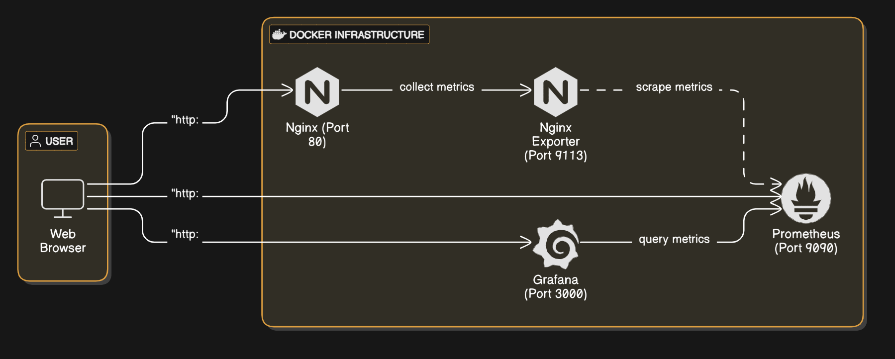

## Setup & Installation

### **1. Start the Monitoring Stack**
Run the following command to start all services using Docker Compose:
```bash
docker-compose up -d
```
This will start:
- **Nginx** on port `80`
- **Nginx Exporter** on port `9113`
- **Prometheus** on port `9090`
- **Grafana** on port `3000`

### **2. Verify if Everything is Running**
Check running containers:
```bash
docker ps
```
Expected output should show `nginx`, `nginx-exporter`, `prometheus`, and `grafana` running.

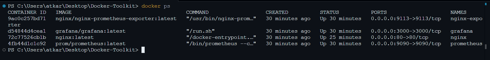

## Verification & Testing

### **1. Check Nginx Status Page**
Access Nginx Browser at [http://localhost](http://localhost)

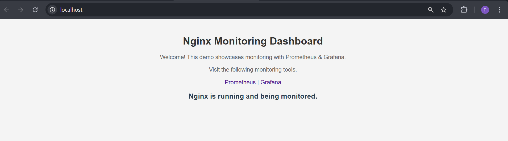

Run:
```bash
curl http://localhost/stub_status
```

or open in browser at
[http://localhost/stub_status](http://localhost/stub_status)

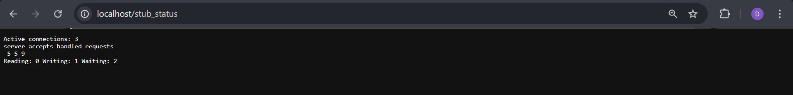

### **2. Check Prometheus Metrics**
1. Open Prometheus Web UI: [http://localhost:9090](http://localhost:9090)

2. Navigate to **Status → Targets** ([http://localhost:9090/targets](http://localhost:9090/targets))
3. Ensure `nginx-exporter` is `UP`.
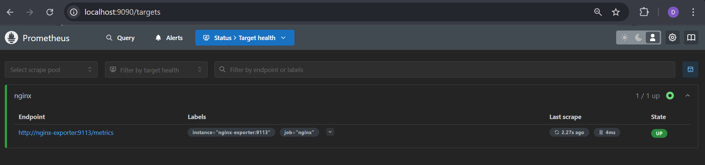

#### **Run Queries in Prometheus**
Go to [http://localhost:9090/query](http://localhost:9090/query) and execute:
```promql
nginx_requests_total
nginx_connections_reading
nginx_connections_handled
nginx_connections_requests
```
If data appears, Prometheus is successfully scraping metrics.

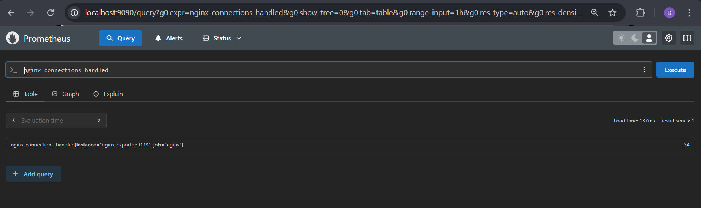

## Grafana Setup

### **1. Access Grafana**
1. Open: [http://localhost:3000](http://localhost:3000)
2. Login:
   - Username: `admin`
   - Password: `admin` (default; change after login)

### **2. Add Prometheus as a Data Source**
1. Go to **Connections → Data Sources**
    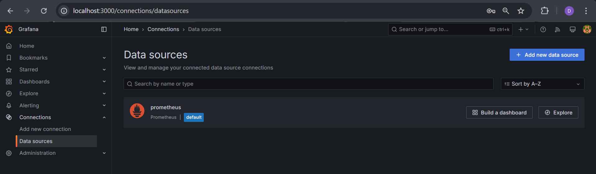
2. Click **Add Data Source**
3. Select **Prometheus**
4. Set URL to:
   ```
   http://prometheus:9090
   ```

    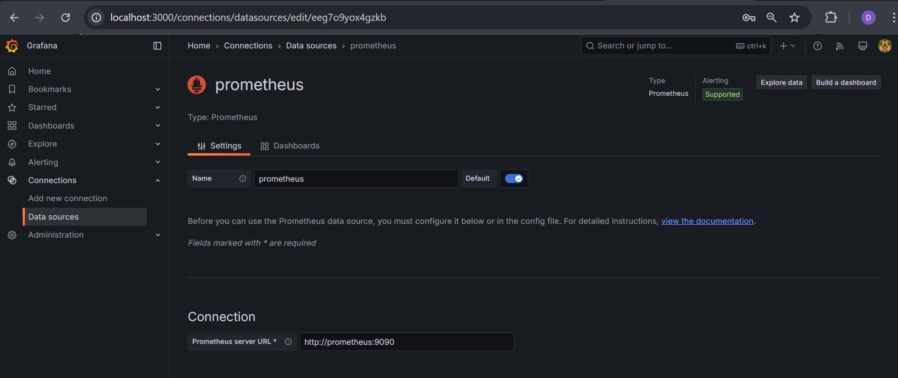
5. Click **Save & Test**
     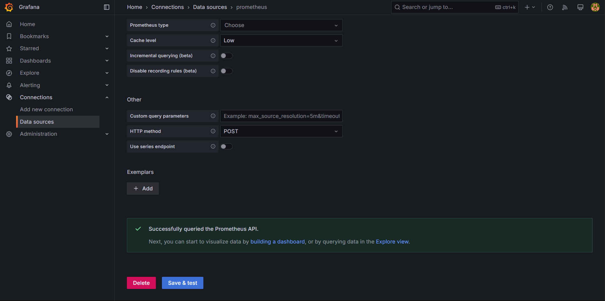

If successful, Prometheus is connected!

### **3. Create a Dashboard for Nginx Metrics**
#### **Manually Create Panels**
1. Go to **Dashboards → Create → New Dashboard**
    ![graph-dash-1(./images/graph-dash-1.png)
2. Click **Add a new panel**
3. In the **Query** field, enter:
   ```promql
   nginx_connections_active
   ```

   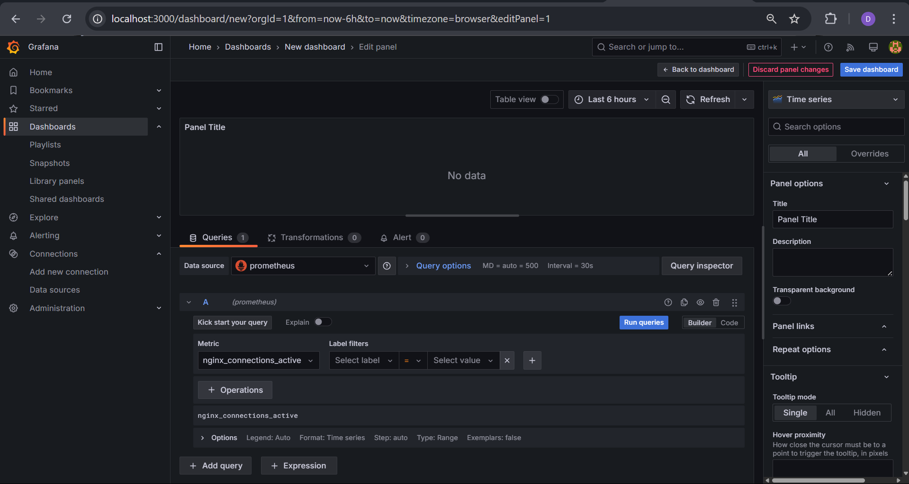
4. Click **Apply**

5. Click **Save Dashboard** and name it **Nginx Monitoring**
    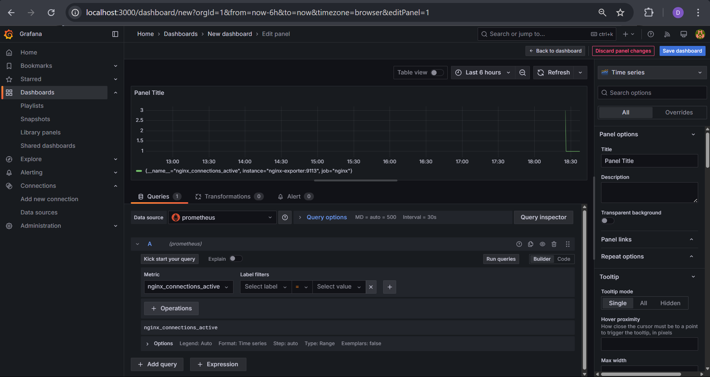

6. Repeat for other metrics: (optional)
   ```promql
    nginx_requests_total
    nginx_connections_reading
    nginx_connections_handled
    nginx_connections_requests
   ```

Or you can also import prebuilt dashboards.

View the dashboard
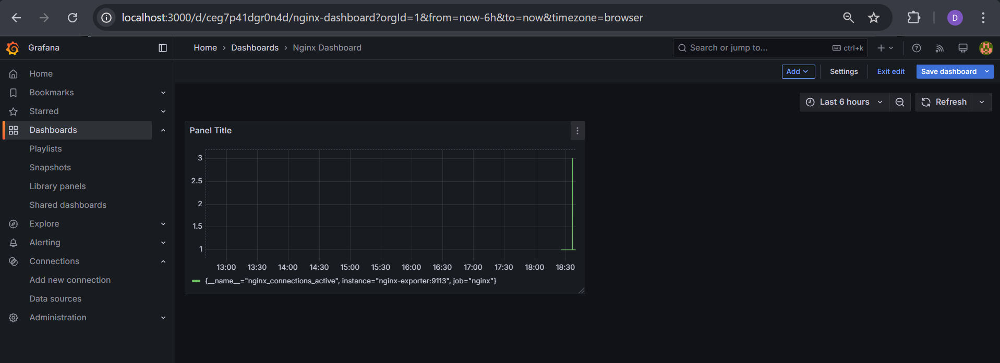

## **Simulating Traffic to View in Grafana**
To generate continuous requests to Nginx and see live data in Grafana, run:
```bash
while true; do curl -s http://localhost > /dev/null; sleep 1; done
```
This will send a request every second. You can adjust the `sleep` value to control request frequency.

Now, check **nginx_connections_active** in your Grafana dashboard to visualize live traffic.

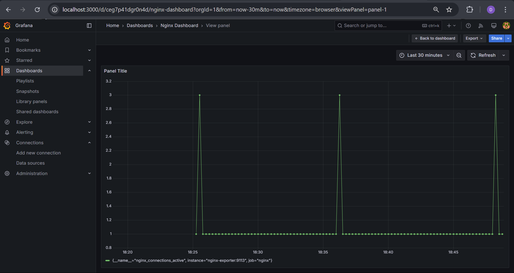

## **Troubleshooting**
### **1. Prometheus Not Scraping Metrics?**
Check logs:
```bash
docker logs prometheus
```
Verify `prometheus.yml` contains:
```yaml
scrape_configs:
  - job_name: 'nginx'
    static_configs:
      - targets: ['nginx-exporter:9113']
```
Restart Prometheus:
```bash
docker-compose restart prometheus
```

### **2. No Data in Grafana?**
- Ensure **Prometheus is running**: `docker ps`
- Verify **Prometheus is accessible**:
  ```bash
  curl http://localhost:9090/api/v1/status/config
  ```
- Ensure **queries return data in Prometheus** before checking Grafana.

## **Conclusion**
You now have a fully functional **monitoring setup using Prometheus & Grafana**! 🚀

If you need further customization, feel free to tweak Grafana dashboards and Prometheus configs. Happy monitoring! 🎯

---
