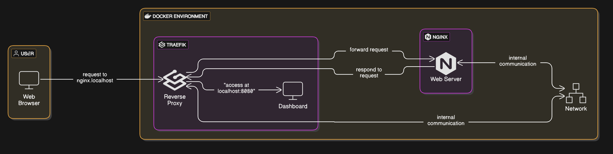
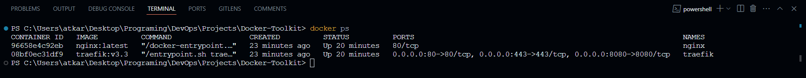
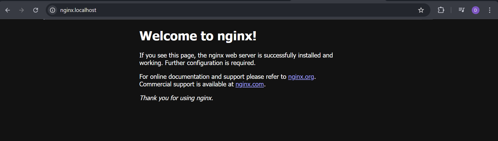
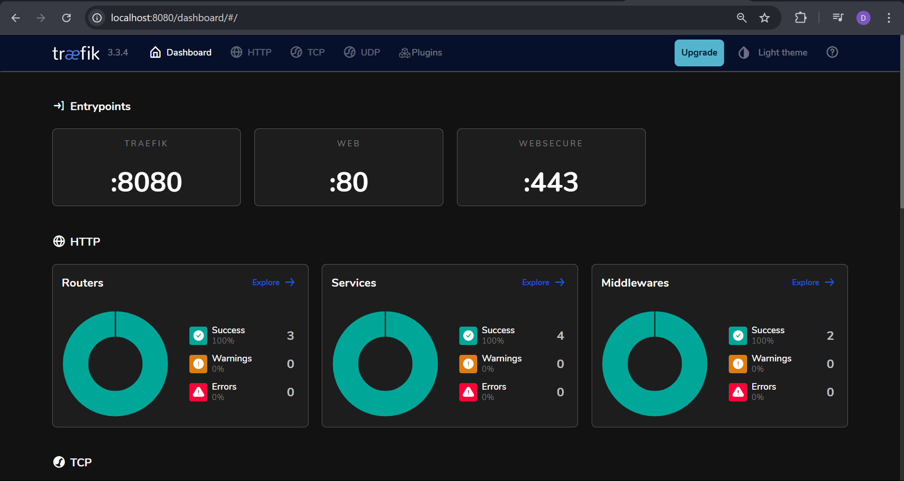

# Reverse Proxy Setup with Traefik and Nginx

## Project Overview
This project demonstrates how to use **Traefik** as a reverse proxy to manage traffic between services running in Docker. We set up an **Nginx web server** that is accessible via `nginx.localhost`, and we configure **Traefik** to dynamically route requests based on domain names. The Traefik dashboard is also enabled for monitoring and managing configurations.

## Architecture and Flow
The project consists of:
1. **Traefik Reverse Proxy**
   - Runs on ports **80, 443, and 8080**.
   - Listens to Docker events and automatically configures routes.
   - Does **not** expose any services by default unless explicitly enabled.
   - Provides a **dashboard** on `localhost:8080` (enabled but insecure in this setup).

2. **Nginx Web Server**
   - Accessible via `nginx.localhost`.
   - Uses Traefik for routing through the **web entrypoint (port 80)**.
   - Does not directly expose any ports.

## Architecture Diagram
Below is the architecture diagram illustrating how Traefik routes requests to Nginx:


## Running the Project
Before starting, create the required **Traefik network**:
```sh
docker network create traefik
```

Then, start the services using:
```sh
docker-compose up -d
```

Verify that the containers are running:
```sh
docker ps
```


## Accessing Services
- **Nginx Web Server** → Open [http://nginx.localhost](http://nginx.localhost) in your browser.
    

- **Traefik Dashboard** → Open [http://localhost:8080](http://localhost:8080).
    

## Notes
- The `insecure: true` setting in `traefik.yml` exposes the dashboard without authentication. Remove this in production.
- Ensure your system resolves `nginx.localhost` to `127.0.0.1`. If not, add it to your **hosts file**:
  ```sh
  echo "127.0.0.1 nginx.localhost" | sudo tee -a /etc/hosts
  ```

## Conclusion
This setup provides a simple yet powerful reverse proxy using **Traefik** and **Nginx**. With minimal configuration, you can dynamically route traffic, manage multiple services, and enable monitoring via the Traefik dashboard.
